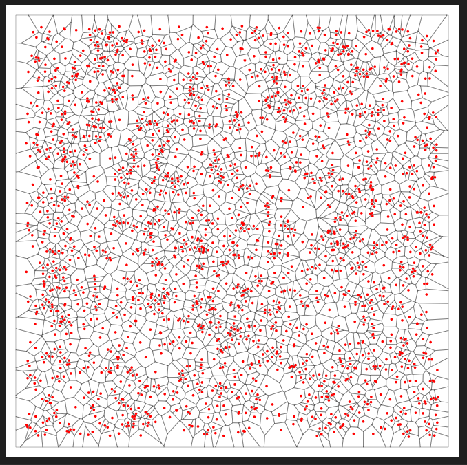
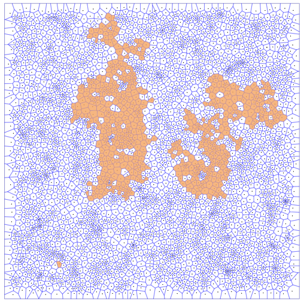
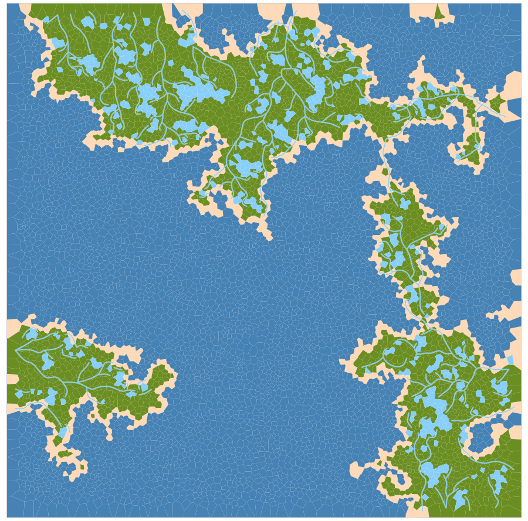

### Random map generation to create islands using Rust

The idea is to expand this to start rendering 3d models in vulkan API, generating unique islands with biomes and further generating Exportable maps for games or cartography designs

1. Uses Voronoi diagram to define cells that can be used to generate the map

2. Randomly selects cells as starting points for islands and expands them using a GAMMA constant (rand [0-1] > GAMMA)

3. Fills in oceans and lakes on the empty cells, then generates rivers based on freshwater sources

### TO DO
1. Improve data structure to make modification more simple and expandable, as we're currently depending on the custom implementation of voronoice

2. Add height maps and better river simulation based on elevation

3. Simulate Erosion and Humidity on land

4. Create cities and simulate trade routes between them, construct roads
   * can be done iteratively on cycles as well to simulate a living environment

5. Simulate more biomes and weather

6. Improve rendering, hopefully implement vulkan rendering or an engine like Bevy to create 3d environments with textures

7. Generate cartography style maps based on the land and also possible generation of city maps for each generated city